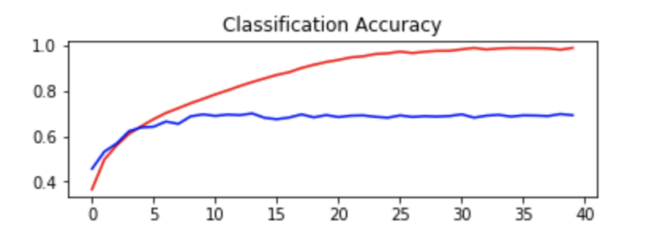

# Claudia Nikel's Personal Portfolio

## Projects

### 1. CNN: Image Classification
Created a convolutional neural network using the CIFAR-10 dataset to classify 32x32 colour images in 10 classes (airplanes, automobiles. birds, horses, trucks, etc). Each layer used the ReLU activation function and the He initilization and I used a 3-block VGG model for the CNN. I plotted the accuracy and cross-entropy loss for the model with increasing number of epochs.   

**Plot of the Accuracy:** 
In general, models improve with more epochs of training, but only to a point and then they will start to plateau in accuracy as they converge. Originally I tried using 100 epochs but it wouldn't run on my computer. I decided to slowly increase the number of epochs and was able to run the model with 40 epochs. The red line represents the model's performance on the training dataset and the blue line represents the models performance on the test dataset. The accuracy on the test data is around 62%.  

 

**Plot of the Cross Entropy Loss:**
You can see from this graph that the model overfits the test data because the models performance on the training data (red line) decreases (so it improves) whereas on the test data (blue line) improves slightly but then increases (gets worse) around 10 epochs.  

 

**Conclusion:**
Because the images are of very low resolution that could be a cause for the misclassification and lower accuracy. As well using a higher number of epochs, say 100, would definitely give an improved result. The model was able to learn the training data, which is a good sign. To improve the results of the model on the test data, you could add more VGG blocks. However, increasing the number of epochs (the number of complete passes through the training dataset) and the number of VGG blocks requires more computer power and time. This model also shows overfitting at around 10-15 epochs.    

**Code for the CNN can be found in the CNN_Image_Classification folder**

### 2. Tableau Dashboard
An interactive Tableau Dashboard created using a Urban Social Disorder dataset from the Peace Research Institute Oslo (PRIO) which contains information on urban social disorder events that occur in capitals and other major cities of the developing world between 1960 and 2014.  

Visit: https://public.tableau.com/profile/eva.nguyen#!/vizhome/551_project/Dashboard1 and https://public.tableau.com/profile/eva.nguyen#!/vizhome/551_project/Dashboard2 
Co-collaborators: Eva Nguyen, Ja Cho

### 3. Shiny App
App that uses flight data to show the worst airport connections for delayed and cancelled flights in the USA geographically. Switch between delayed and cancelled flights and use the slider to determine the cutoff for the number of flights. Try the interactive web-version here: https://claudia-nikel.shinyapps.io/R_code/  

### 4. NASA Mars API
An API to retrieve and visualize weather data from the last 7 Sols (Martian days) as recorded and updated daily by NASA's InSight Mars lander. InSight is located at Elysium Planitia, a flat surface near the equator of Mars. The python package built contains four functions: 
 

`marsInfo`: returns a summary table of weather including the Sol number, datetime stamp of first recorded sample (`First_UTC`), last recorded sample (`Last_UTC`), the current season for Mars, as well as average (`av`), sample size (`ct`), minimum (`mn`) and maximum (`mx`) recordings for temperature (`AT`), horizontal windspeed (`HWS`), and pressure (`PRE`).

`marsAverage`: takes the saved output from the marsInfo() function and returns the average temperature, windspeed, and pressure for the last 7 Sols.

`windspeed`: retrieves the inputted Sol's horizontal wind speed (m/s) from the summary table and visualizes it as a dial. The black bar is the average windspeed for the Sol, which corresponds to the black text. The green background is the sol range (min and max), and the red or green text below is represents a decrease or increase, respectively, relative to the previous sol's average.  

`pressure`: retrieves the inputted Sol's pressure (Pascal) from the summary table and visualizes it as a dial. The black bar is the average pressure for the Sol, which corresponds to the black text. The orange background is the sol range (min and max), and the red or green text below is represents a decrease or increase, respectively, relative to the previous sol's average.  

`temperature`: retrieves the inputted Sol's temperature (converted from Farhenheit to degrees Celsius) from the summary table and visualizes it as a dial. The black bar is the average temperature for the Sol, which corresponds to the black text. The blue background is the sol range (min and max), and the red or green text below is represents a decrease or increase, respectively, relative to the previous sol's average.  

Link to projects repository: https://github.com/claudia-nikel/maRs  
Co-collaborator: KT Hobbs

### 5. 3D Drone Modeling & 2D Drone Mapping
Created 3D models and collaborative maps using a drone and software platform

Utilized drone imagery to create vegetation and elevation maps of buildings all of which can be used in the agriculture, construction, surveying and inspection industries 

